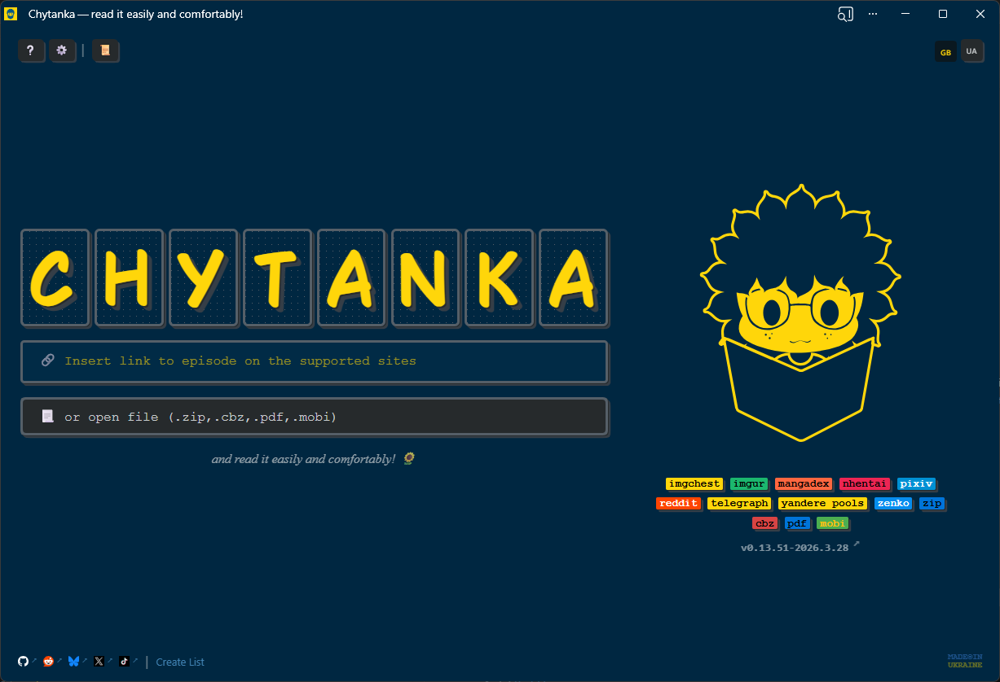

# Chytanka

**Chytanka** is a lightweight, privacy-friendly PWA for reading manga, comics, and visual stories — from online sources, your own server, or local files.

No accounts. No tracking. Just reading.

## 🚀 Get Started

👉 [https://chytanka.ink](https://chytanka.ink)

## ⚡ Why Chytanka?

- 🌍 Open anything — links, APIs, or local files
- 📂 No uploads — your files stay on your device
- 🧠 Smart behavior — auto-detect reading mode via tags
- 🎮 Gamepad ready — full control without mouse
- 🌓 Comfort first — night filter, fullscreen, responsive

## 🖼️ Preview



## Features

### 🖥️ **Read Episodes Online**

Chytanka supports opening episodes from the following platforms:

- [x] ~~[Blankary](https://blankary.com)~~ (image support has been discontinued)
- [x] ~~[Comick](https://comick.io)~~ (baned)
- [x] [Imgur](https://imgur.com)
- [x] [Mangadex](https://mangadex.org)
- [x] [Nhentai](https://nhentai.net)
- [x] [Pixiv](https://pixiv.net)
- [x] [Reddit](https://reddit.com)
- [x] [Telegra.ph](https://telegra.ph)
- [x] [Yande.re Pool](https://yande.re/pool)
- [x] [Zenko](https://zenko.online)
- [x] [ImageChest](https://imgchest.com/)
- [ ] [Bluesky](https://bsky.app)
<!-- - [ ] [Catbox](https://catbox.moe/) -->
  
#### 🌐 **Custom JSON API**

Chytanka can open episodes from any custom JSON API returning the following format:

```json
{
"title": "Title of the episode",
"nsfw": false,
"images": [
  {
    "src": "full-link-to-image-1"
  },
  {
    "src": "full-link-to-image-2"
  },
  {
    "src": "full-link-to-image-n"
  }
]
}
```

#### 📚 **Create and Share Readlists**

Compile a readlist using [Chytanka Readlist Creator](https://chytanka.ink/list):

1. Paste supported links into the input field.
2. Edit titles (optional; automatic retrieval supported).
3. Generate and publish a JSON readlist on Rentry, Gist, or your server.
4. Use the generated link to start reading with your custom readlist.

### 📂 **Open Local Files**

Chytanka supports opening the following file formats from your device:

- [x] ZIP/CBZ
- [x] PDF
- [x] MOBI
- [ ] DJVU
- [ ] RAR/CBR

### 📖 **Three Reading Modes**

1. **Vertical**: Perfect for webtoons.
2. **Horizontal (RTL)**: Best for manga.
3. **Horizontal (LTR)**: Ideal for comics.

### 🌓 **Blue Light Filter**

Read comfortably at night with Chytanka's built-in blue light filter.

### 📱 **Responsive Viewing**

- In horizontal mode with landscape orientation: view two pages side by side.
- In portrait orientation: view one page at a time.

### 🖥️ **Fullscreen Mode**

Immerse yourself in reading with a fullscreen option.

### 🕒 **Viewing History**

- [x] Tracks history of supported links.
- [x] File history support is planned.

### ⌨️ **Keyboard Shortcuts**

#### On the Start Page

- `F1` — Open FAQ
- `F2` — Open Settings
- `Ctrl+H` — Open History
- `Ctrl+O` — Open File

#### While Reading

- `A`, `D`, `ArrowLeft`, `ArrowRight` — Navigate pages in horizontal mode
- `W`, `S`, `ArrowUp`, `ArrowDown` — Navigate pages in vertical mode
- `Ctrl+O` — Open File
- `Ctrl+E` — Share (copy link or embed code)
- `F` — Toggle Fullscreen

### 🎮 Gamepad Support

Chytanka includes built-in support for gamepads (tested with PlayStation-style controllers). This allows full navigation and interaction without a mouse or keyboard.

#### Navigation & Scrolling

- ⬅️ L1 / D-Pad Left → Scroll left
- ➡️ R1 / D-Pad Right → Scroll right
- ⬆️ D-Pad Up → Scroll up
- ⬇️ D-Pad Down → Scroll down

#### Cursor & Interaction

- 🕹️ Left Stick → Move cursor
- 🕹️ Right Stick → Scroll (both X and Y axes)
- 🔘 Cross (✕) → Click / Select
- 🔘 Circle (○) → Escape (Cancel / Close dialog)

#### Actions

- 🔘 Square (□) → Toggle fullscreen
- 🔘 Triangle (△) → Toggle View Mode
- ☰ Options → Toggle overlay
- 📤 Share → Share (copy link or embed code)

#### Notes

- *Gamepad support relies on the browser's Gamepad API.*
- *Button mapping may vary slightly between browsers.*

### 🔞 **NSFW Content Warning**

If supported by the API, Chytanka warns users about NSFW content.

### 🏷️ Tags in Titles

Chytanka supports special tags inside file names or episode titles to automatically control viewer behavior.

Tags are parsed from the title and applied on load.

#### 📌 Supported Tags

You can include any of the following words in the title:

```
rtl, ltr, ver, long, scroll, nsfw, sfw, color, bw, demo, extra
```

Example:

```
My Manga Vol.1 [rtl][nsfw]
Chapter 5 - [long][scroll]
Demo Episode [ltr]
```

#### 🎯 What Tags Do

##### 📖 View Mode

These tags control how pages are displayed:

| Tag         | Description             | Mode |
| ----------- | ----------------------- | ---- |
| `[rtl]`     | Right-to-left reading   | 1    |
| `[ltr]`     | Left-to-right reading   | 2    |
| `[ver]`     | Vertical / webtoon mode | 3    |
| `[long]`    | Vertical / long strip   | 3    |
| `[scroll]`  | Vertical scrolling      | 3    |

> If multiple tags are present, the first matched tag wins.

##### 🔞 Content Flags

| Tag      | Effect                |
| -------- | --------------------- |
| `[nsfw]` | Marks episode as NSFW |
| `[sfw]`  | (Reserved / optional) |

##### 🎨 Additional Tags (for future use)

These tags are parsed but may be used later:

- `[color]` – colored pages
- `[bw]` – black & white
- `[demo]` – demo content
- `[extra]` – bonus materials

#### ⚙️ How It Works

- Tags are case-insensitive
- Tags are detected as standalone words (e.g. rtl, not ultra)
- Parsed automatically from:
  - file name
  - episode title

#### 💡 Example

```
Attack on Titan - Chapter 1 [rtl][nsfw].cbz
```

Result:

- View mode → Right-to-left
- NSFW flag → enabled

#### 🧠 Notes

- *Tags are processed on episode load*
- *They override default viewer settings*
- *Designed for compatibility with local files (.cbz, .zip) and remote sources*

### 🖇️ **Embed Chytanka on Your Website**

You can embed Chytanka into your website and control it via `postMessage`.

Perfect for:

- manga sites
- blogs
- personal collections

 Learn more in the [Embedding Guide](https://github.com/chytanka/chytanka.github.io/wiki/Embedding-Chytanka-on-Your-Website).

---

## 🛠️ Development

Chytanka requires a proxy server for handling some external sources.
Proxy repository: [https://github.com/chytanka/proxy](https://github.com/chytanka/proxy)

> ⚠️ *Important*: Both Chytanka and the proxy must run on the *same host.*

### ▶️ Run locally on Windows

```bash
# Start proxy on the same host
set NODE_ENV=dev&& set HOST=192.168.0.0 && node index.js
```

```bash
# Start Chytanka app
ng serve --host 192.168.0.0
```

### 💡 Notes

- *The proxy handles CORS and headers for external image sources.*
- *Make sure both services use the same host IP (e.g., 192.168.0.0).*
- *Adjust the host if your network requires a different local IP.*

### 🧠 Why a Proxy?

- Bypasses CORS restrictions from image hosts
- Normalizes headers
- Ensures safe and consistent fetching of external content

## 🔗 Other Chytanka Projects

Chytanka is more than just a reader — it’s an ecosystem. Check out these companion projects:

| Project                  | What it does                                                                       | Repository                                                             |
| ------------------------ | ---------------------------------------------------------------------------------- | ---------------------------------------------------------------------- |
| **Meta Image Generator** | Generates social preview images (meta tags) for episodes                           | [chytanka-meta-image](https://github.com/chytanka/chytanka-meta-image) |
| **Chytanka Helper**       | Browser extension: adds a button to open supported site links directly in Chytanka | [chytanka-helper](https://github.com/chytanka/chytanka-hepler)         |
| **Opera GX Theme**       | Custom theme for Opera GX tailored to Chytanka                                     | [chytanka-gx-mod](https://github.com/chytanka/chytanka-gx-mod)         |
| **Chytanka Make**        | Create and edit CBZ files from images, reorder pages, add metadata                 | [chytanka-make](https://github.com/chytanka/chytanka-make)             |
